## Vision for FSD 

Vision-based path tracking and environment mapping for autonomous vehicles. Extracting important features from monocular frames for advanced driver assistance systems. Currently also working on interpreting features from surround vision and lidar inputs.

**Implemented using geometry based feature extractors and open-sourced models. Not practically useful, more of a research oriented project.**

Part of a larger FSD research stack: [Monocular SLAM](https://github.com/gouthamk16/Slam) · [Environment Reasoning](https://github.com/gouthamk16/drive-vlm) · [DL Based Actuators](https://github.com/gouthamk16/xdrive)

The core idea of this project is to build an end-to-end perception model that leverages these features to predict driving trajectories and actuator-level control signals (steering angle, throttle input, and braking intensity etc) directly from sensor observations.

A major challenge in developing such systems is the massive amounts of annotated driving data required. Modern autonomous driving systems rely heavily on large-scale real-world data collection pipelines. For example, Tesla continuously gathers driving data from customer vehicles in real time, enabling iterative large-scale training and refinement of its Autopilot models (they call it "Fleet-Learning"). This continuous learning approach provides access to highly diverse driving scenarios and edge cases which significantly improves model generalization.

Research/Study on hardware required to run such systems [here](hardware.md)

---

## What the monocular vision extractor does

Each video frame is passed through four subsystems running in sequence:

| Subsystem | Model | Output |
|---|---|---|
| Object detection + tracking | YOLOv2.6 + ByteTrack | 2D bounding boxes with locked class labels and per-object distance |
| Monocular depth estimation | DepthAnything V2 (metric outdoor) | Per-pixel depth map in metres |
| Drivable area segmentation | YOLOPv2 | Binary pixel mask separating drivable road from non-drivable regions |
| Visual odometry | SIFT + FLANN + Essential matrix | Camera pose and trajectory |

Depth and segmentation outputs are fused in the final render: the drivable area is overlaid as a green tint on the frame, detected vehicles get per-object distance labels from the depth map, and everything is summarised in a bird's-eye-view (BEV) minimap covering ~83 m forward range.

## Results

<table>
  <tr>
    <td width="50%" align="center">
      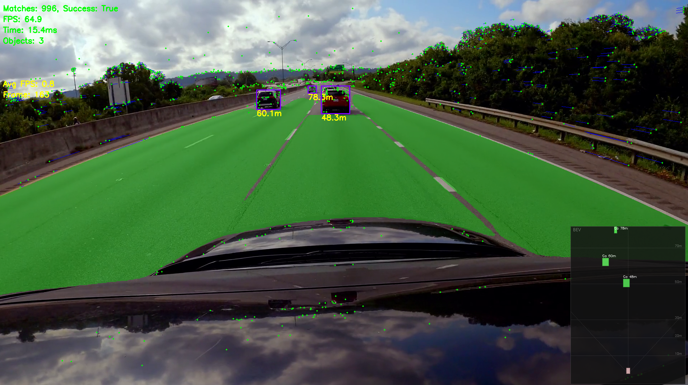<br>
      <sub>Detection + drivable-area segmentation + BEV minimap</sub>
    </td>
    <td width="50%" align="center">
      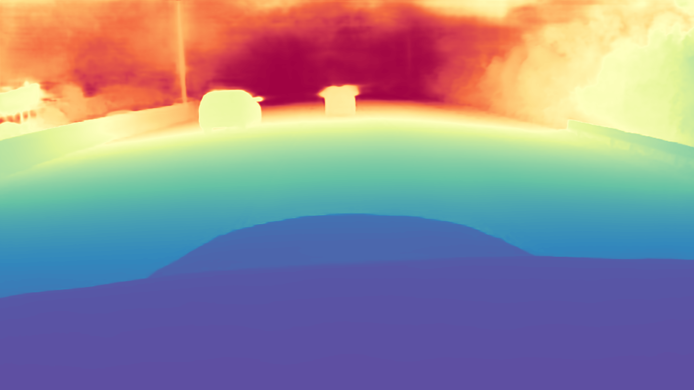<br>
      <sub>Monocular depth estimation (a different frame)</sub>
    </td>
  </tr>
  <tr>
    <td width="50%" align="center">
      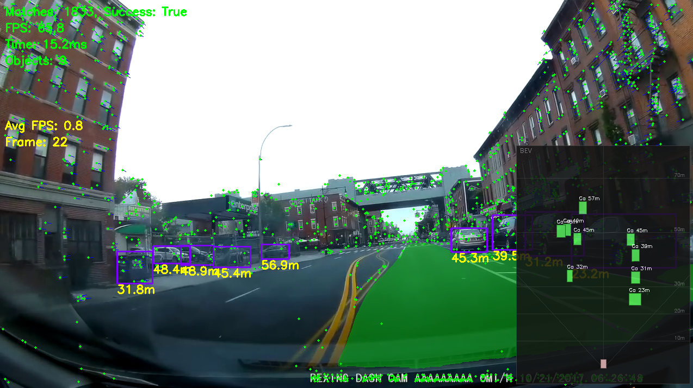<br>
      <sub>Understands double yellow lines - only the current lane is marked drivable</sub>
    </td>
    <td width="50%"></td>
  </tr>
</table>

---

## 360 Vision - nuScenes 

Beyond single-camera dashcam footage, we also work with the [nuScenes](https://www.nuscenes.org/) dataset, which has six surround-view cameras + LiDAR on a real autonomous vehicle. This lets us look in all directions at once and work with proper 3D sensor data instead of inferring depth from a single image. Implemented in the [fsd](fsd/) folder.

nuScenes is organised as ~850 independent 20-second driving clips (called scenes), each with ~40 keyframes at 2 Hz. They're not continuous - scene 5 has nothing to do with scene 6 temporally or geographically, but each scene on its own is a clean, calibrated, fully-labelled snippet of real urban driving.

### What we can visualise

| View | What it shows |
|---|---|
| `cameras` | All six cameras tiled into a contact sheet |
| `lidar` | LiDAR point cloud projected onto each camera image, coloured by depth |
| `bev` | Bird's-eye-view of the LiDAR sweep from above |
| `lss_bev` | Camera-only BEV vehicle prediction from Lift-Splat-Shoot, drawn on top of the nuScenes HD map |
| `lss_lidar_bev` | LSS prediction blended onto the LiDAR BEV for a direct sanity check |
| `occupancy_bev` | Temporal log-odds occupancy map fused across keyframes into a rolling world model |
| `planner_bev` | Offline LiDAR BEV planner: candidate trajectories, selected path, and collision context |
| `planner_camera` | Front-camera overlay with selected path projected onto video and a compact BEV panel |
| `height_bev` | 2.5D BEV tensor - per-cell point density and min/max/mean/range height channels |
| `world_bev` | Unified BEV world model: occupancy, height/collision context, ego state, object footprints, and per-object velocity arrows + predicted motion |
| `all` | All views rendered simultaneously |

### Camera-only BEV with Lift-Splat-Shoot

The six surround cameras alone are enough to estimate a top-down vehicle occupancy map. We integrate NVIDIA's [Lift-Splat-Shoot](https://github.com/nv-tlabs/lift-splat-shoot) (ECCV 2020): each camera image is lifted into a per-pixel depth distribution, splat into a shared ego-frame voxel grid, and decoded into a BEV vehicle segmentation. The pretrained checkpoint runs without finetuning, and we render the output on top of the nuScenes HD map expansion pack (includes lanes, road outlines, lane lines etc). Implementation in [fsd/lss.py](fsd/lss.py) and [fsd/nuscenes_map.py](fsd/nuscenes_map.py).

### Temporal occupancy - from per-frame perception to a world model

Everything above is per-frame: process a sweep, draw it, move on. The occupancy view makes the system stateful. We keep a rolling log-odds grid in the ego frame, and each keyframe we warp the previous grid into the new ego frame using the nuScenes ego poses, decay it slightly, then fold in fresh LiDAR evidence - ground-height returns mark cells free, taller returns mark them occupied. The result is a continuously evolving map of free space and obstacles instead of a single-frame snapshot - the drivable corridor trailing behind the ego is evidence accumulated over the whole scene. This is the classical, debuggable groundwork for downstream trajectory planning. Implementation in [fsd/occupancy.py](fsd/occupancy.py).

### 2.5D height channels - a richer BEV tensor

The plain BEV only knows "cell has points or not." The height tensor keeps the vertical information instead of throwing it away: for every cell we record point density and the min, max, mean, and range of the LiDAR heights that landed there. `height_range` (max - min) is the useful one - flat road is near zero, cars and walls are large - so it separates drivable surface from obstacles with pure geometry, no labels. This is the data structure downstream modules (planning, lane fitting, the object layer) read instead of re-rasterizing raw points. Implementation in [fsd/bev_tensor.py](fsd/bev_tensor.py).

### Unified BEV world model

The world model combines the separate BEV layers into one state object: temporal occupancy probability, 2.5D LiDAR height channels, collision cells, ego speed/state, and object footprints from GT boxes or detector predictions. This is the handoff point between perception and planning. Implementation in [fsd/world_model.py](fsd/world_model.py).

### Object velocity + short-horizon prediction

Until now the world model only saw the present - "there is a car here". This layer gives objects motion: "that car is moving at 7 m/s and will be here in 2 s". We start with a ground-truth oracle because nuScenes annotations carry a stable `instance_token`, so matching the same object across keyframes is free and association error is zero - the right baseline to validate a learned tracker against later. For each object we recover its global position, finite-difference it across consecutive keyframes for true ground velocity, rotate that velocity into the current ego frame, and extrapolate at constant velocity to 1/2/3 s horizons. The `world_bev` view draws a cyan velocity arrow (1 s lookahead, so arrow length equals speed in metres), a faded future ghost footprint, and a per-object speed label. Verified on scene 0: the first keyframe shows zero velocity (no prior), and subsequent frames recover realistic 5-8 m/s vehicle speeds. Implementation in [fsd/tracking.py](fsd/tracking.py). Next: swap the `instance_token` oracle for greedy nearest-by-class association over CenterPoint predictions.

### Results

<table>
  <tr>
    <td width="50%" align="center">
      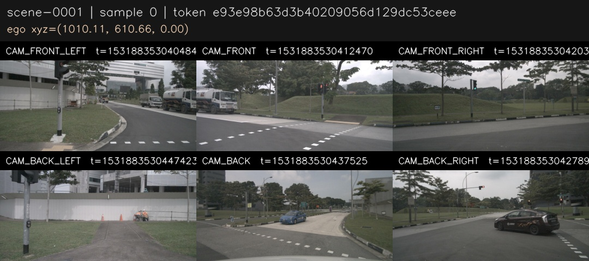<br>
      <sub>Six surround cameras tiled into a contact sheet</sub>
    </td>
    <td width="50%" align="center">
      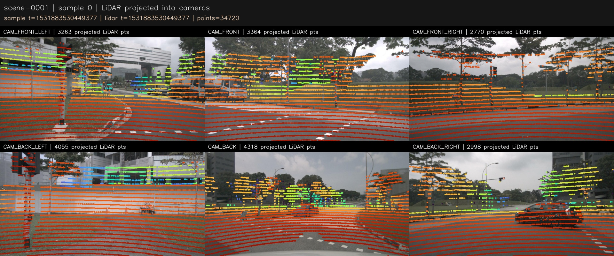<br>
      <sub>LiDAR projected onto the camera images, coloured by depth</sub>
    </td>
  </tr>
  <tr>
    <td width="50%" align="center">
      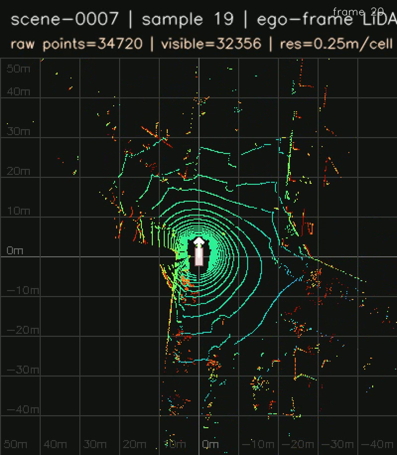<br>
      <sub>Bird's-eye-view of a single LiDAR sweep</sub>
    </td>
    <td width="50%" align="center">
      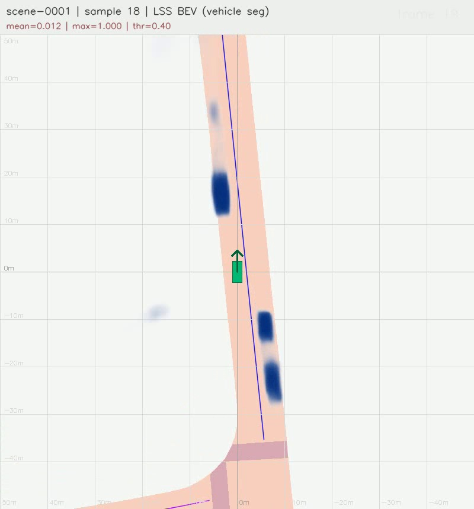<br>
      <sub>Lift-Splat-Shoot camera-only vehicle BEV on the HD map (singapore-onenorth)</sub>
    </td>
  </tr>
  <tr>
    <td width="50%" align="center">
      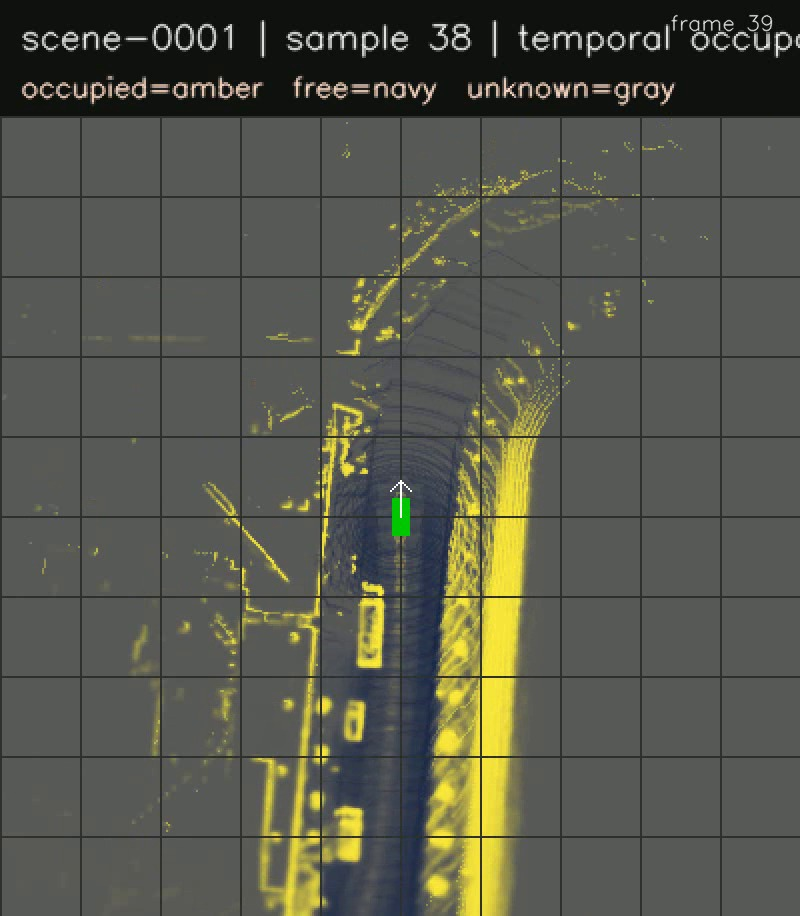<br>
      <sub>Temporal occupancy - log-odds fused across a scene (amber=occupied, navy=free, gray=unknown)</sub>
    </td>
    <td width="50%" align="center">
      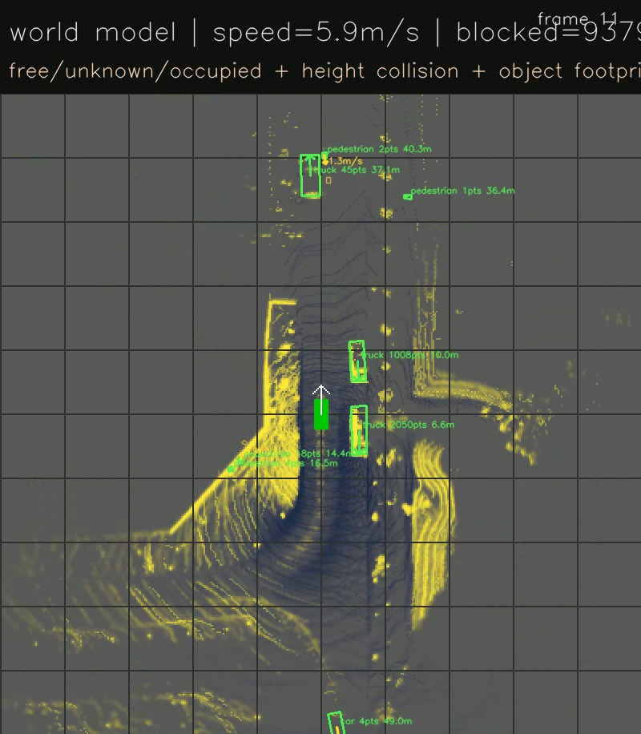<br>
      <sub>Unified BEV world model - occupancy, collision context, ego state, object footprints, and per-object velocity (cyan arrows + m/s labels)</sub>
    </td>
  </tr>
  <tr>
    <td colspan="2" align="center">
      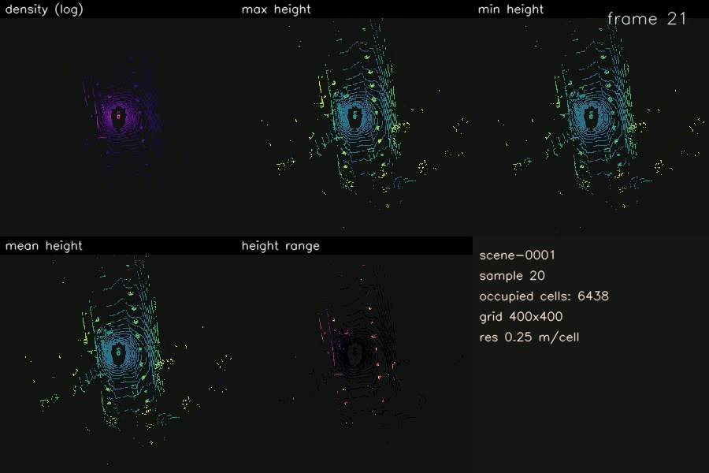<br>
      <sub>2.5D BEV tensor - per-cell point density and min/max/mean/range height channels (one panel each)</sub>
    </td>
  </tr>
</table>

### Run

```bash
# Single scene, default 20 keyframes
python -m fsd.visualize --view cameras --save

# All frames in a scene
python -m fsd.visualize --view lidar --frames all --save

# Stitch scenes 0 through 9 into one video
python -m fsd.visualize --scenes 0-9 --frames all --view cameras --save

# Stream all three views at once
python -m fsd.visualize --view all --frames all --stream

# Unified BEV world model
python -m fsd.visualize --dataroot D:/nuscenes --view world_bev --frames 40 --save

# Smoother video using raw camera sweeps (~12 Hz instead of 2 Hz keyframes)
python -m fsd.visualize --view cameras --sequence sweeps --frames all --save
```

nuScenes data should live at `D:/nuscenes` or set `NUSCENES_ROOT` to point elsewhere.

---

## Motion Planning - WIP

Motion planning is experimental for now. The planner uses LiDAR-derived occupancy, 2.5D height range, and ego-pose velocity to build timed local trajectory candidates in ego coordinates. `planner_bev` shows the candidate set and selected path from above. `planner_camera` projects the selected ground-plane path into the front camera and keeps a compact BEV panel below it for validation. This first planner is lane-optional and does not yet include lane topology, object prediction, route goals, or traffic rules. Implementation in [fsd/motion_planning/](fsd/motion_planning/).

<table>
  <tr>
    <td width="50%" align="center">
      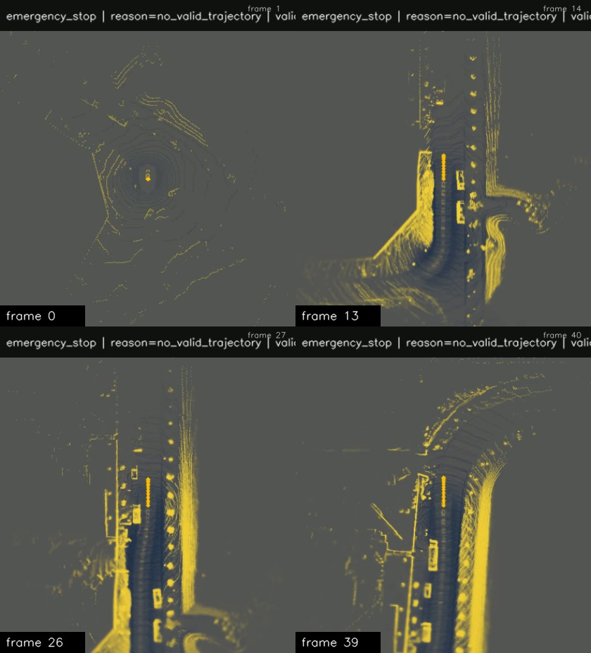<br>
      <sub>Offline planner BEV - valid candidates in gray and selected timed trajectory in green</sub>
    </td>
    <td width="50%" align="center">
      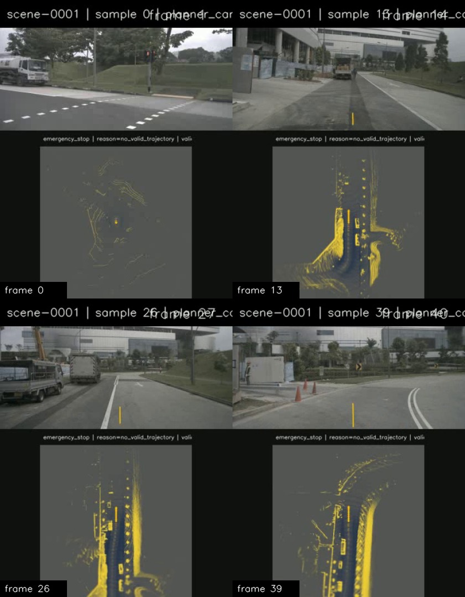<br>
      <sub>Planner camera view - selected trajectory projected into CAM_FRONT with planner BEV context underneath</sub>
    </td>
  </tr>
</table>

```bash
# Offline planner BEV for 20 keyframes
python -m fsd.visualize --dataroot D:/nuscenes --view planner_bev --frames 20 --save

# Front-camera planner path projection with compact BEV context
python -m fsd.visualize --dataroot D:/nuscenes --view planner_camera --frames 20 --save
```

---

## Requirements

- Python 3.12
- CUDA-capable GPU (tested on RTX 4060, CUDA 12.8)

---

## Setup

### 1. Clone and create environment

```bash
git clone <this-repo>
cd vision-fsd
python -m venv .venv
# Windows
.venv\Scripts\activate
# Linux / macOS
source .venv/bin/activate
```

### 2. Install PyTorch with CUDA

Install the CUDA 12.8 build from pytorch.org. The requirements.txt pins the `+cu128` variants, so install those first before the rest of the deps:

```bash
pip install torch torchvision torchaudio --index-url https://download.pytorch.org/whl/cu128
```

### 3. Install remaining dependencies

```bash
pip install -r requirements.txt
```

### 4. Add your video

Place a dashcam video at `data/` and pass the path at runtime.

---

## Run

```bash
# Stream processed output to screen
python main.py data/your_video.mp4 --stream

# Save annotated video to disk
python main.py data/your_video.mp4 --save

# Limit to first N frames (useful for quick tests)
python main.py data/your_video.mp4 --stream --frames 300

# Full options
python main.py --help
```

---

## Models

| File | Size | Source |
|---|---|---|
| `yolo26n.pt` | ~6 MB | Included in repo |
| `yolopv2.pt` | ~70 MB | Auto-downloaded from GitHub releases on first run |
| DepthAnything V2 (metric outdoor large) | ~335 MB | Auto-downloaded from HuggingFace on first run |
| Lift-Splat-Shoot BEV vehicle seg (`model525000.pt`) | ~55 MB | Manual: [Google Drive](https://drive.google.com/file/d/1bsUYveW_eOqa4lglryyGQNeC4fyQWvQQ/view?usp=sharing), drop into `models/` and pass via `--lss-weights` |

---

## Todo

- Extended Kalman filters for trajectory mapping and path tracking
- Lane detection (probably using a pretrained model, training a lane det model today is useless)
